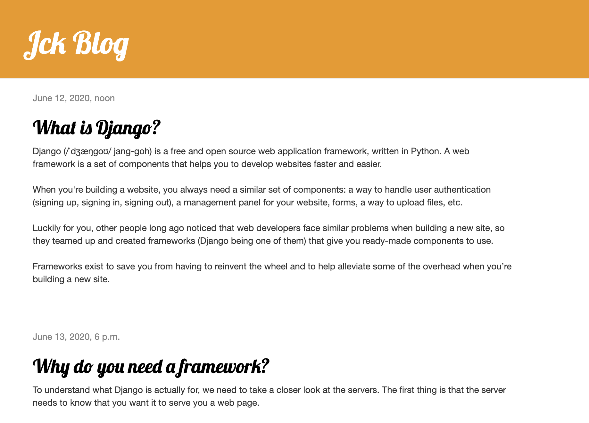

# Django-blog
My first blog running on Django.

### How to run the Django service:

1- Open the terminal and go the project folder  
2- Run `source myvenv/bin/activate`  
3- Then run `python manage.py runserver`  

 

